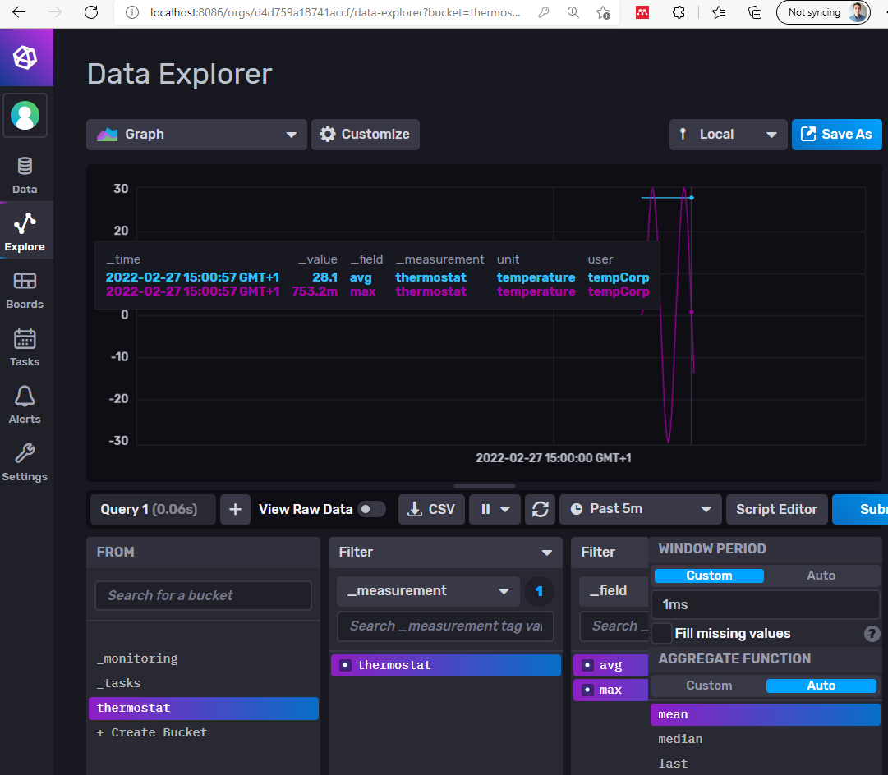

# Example InfluxDB client

to run
1. start influxDB using docker-compose 
1. export the env variables
`source .env.test && export $(cut -d= -f1 .env.test)`
1. run the go app to write 100 sample data points to influx
`go run .`  
(note that the go app sleeps for .1s between each write)
1. use the influxDB UI to view the data at http://localhost:8086

**Output** 
```
created new bucket:  thermostat
writing record 100 of 100: done. view in UI at http://localhost:8086
```




## Sources
Code for Connection and testing from: 
https://www.influxdata.com/blog/getting-started-go-influxdb/
https://github.com/influxdata/influxdb-client-go  

This repo does not enable TLS. TLS is necessary in production: https://docs.influxdata.com/influxdb/v2.1/security/enable-tls/   

# Info on InfluxDB

## Records Format  
A record in InfluxDB is composed of three elements: measurementName, fields and tags. The key concepts of InfluxDB include:

1. measurementName, which refers to a dataset
2. fields, which are key/value pairs
3. tags, which are also key/value pairs, but act as indexes for your record.


## inserting Data
The InfluxDB Go client library offers three ways to insert data:


* [Line protocol](https://docs.influxdata.com/influxdb/v2.1/reference/syntax/line-protocol/) uses text-based database queries

```Go
func write_event_with_line_protocol(client influxdb2.Client, t ThermostatSetting) {
    // get non-blocking write client
    writeAPI := client.WriteAPI(org, bucket)
    // write line protocol
    writeAPI.WriteRecord(fmt.Sprintf("thermostat,unit=temperature,user=%s avg=%f,max=%f", t.user, t.avg, t.max))
    // Flush writes
    writeAPI.Flush()
} 
```

* Data point with a constructor using maps to populate the data.  

```Go
func write_event_with_params_constror(client influxdb2.Client, t ThermostatSetting) {
    // Use blocking write client for writes to desired bucket
    writeAPI := client.WriteAPI(org, bucket)
    // Create point using full params constructor
    p := influxdb2.NewPoint("thermostat", //measurement
        map[string]string{"unit": "temperature", "user": t.user}, // tags
        map[string]interface{}{"avg": t.avg, "max": t.max}, // fields
        time.Now())
    writeAPI.WritePoint(p)
    // Flush writes
    writeAPI.Flush()
}
```

* Data point with fluent style uses a step-by-step builder pattern

```Go
func write_event_with_fluent_Style(client influxdb2.Client, t ThermostatSetting) {
    // Use blocking write client for writes to desired bucket
    writeAPI := client.WriteAPI(org, bucket)
    // create point using fluent style
    p := influxdb2.NewPointWithMeasurement("thermostat").
        AddTag("unit", "temperature").
        AddTag("user", t.user).
        AddField("avg", t.avg).
        AddField("max", t.max).
        SetTime(time.Now())
    writeAPI.WritePoint(p)
    // Flush writes
    writeAPI.Flush()
}
```

Don’t use the Flush methods everywhere. Even if it seems reasonable to write the data instantly to the database, it can significantly affect performance. Instead, use the Batch Size option.
